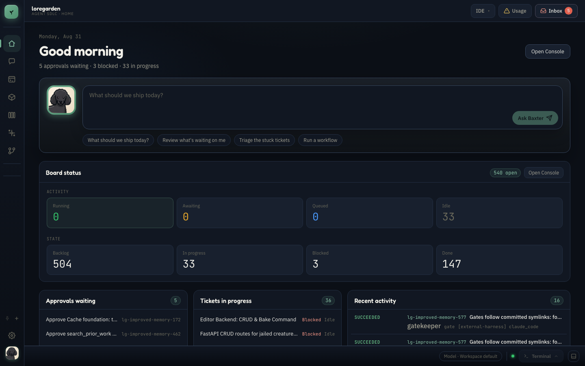
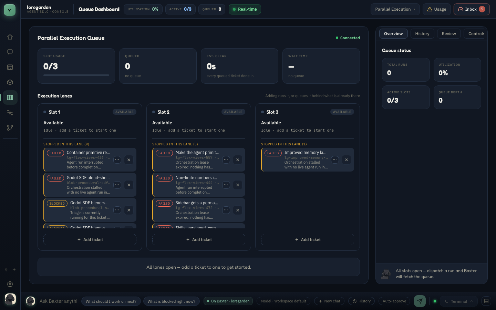
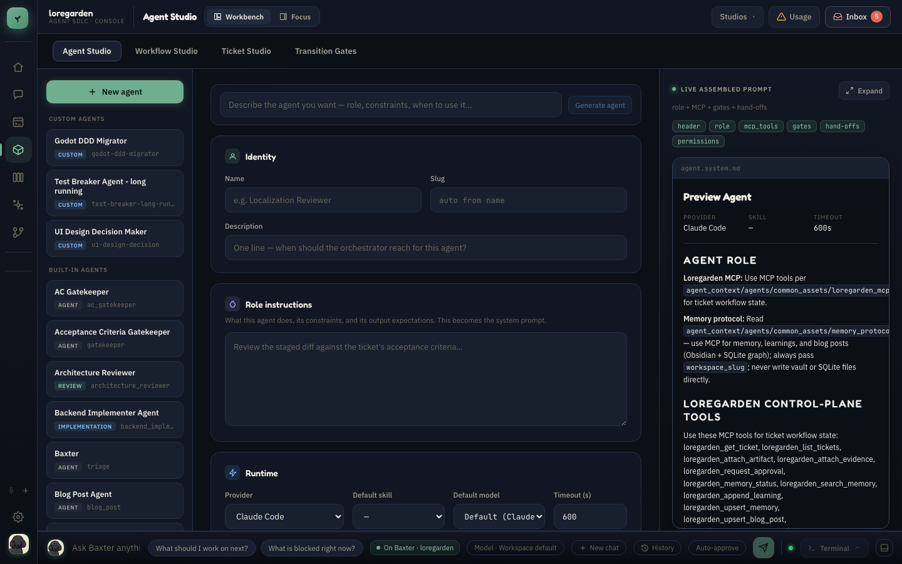
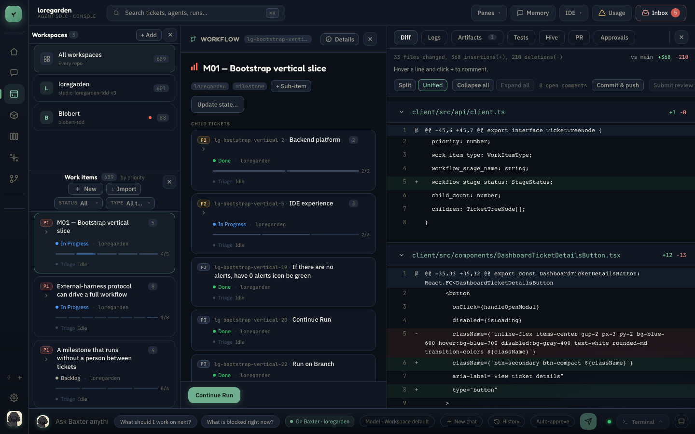

# Loregarden

Loregarden is an Agent SDLC IDE: a local control plane for orchestrating multi-agent software development. It tracks work as tickets in SQLite, runs agents through configurable pipelines, isolates concurrent work in Git worktrees, surfaces approval prompts in an inbox, and exposes the same workflow tools over MCP.

## Screenshots

| Home board | Parallel execution queue |
|---|---|
|  |  |

| Agent Studio | Ticket console (diff, workspace tree) |
|---|---|
|  |  |

## Architecture

| Layer | Stack | Role |
|-------|-------|------|
| **Control plane** | FastAPI + SQLModel + SQLite | Tickets, workflows, runs, approvals, memory, and MCP |
| **IDE shell** | React 19 + TypeScript 6 + Vite 8 + Zustand | Home, ticket studio, queue, agent studio, approvals, terminal, and composed views |
| **Desktop shell** | Tauri 2 | Native packaging for the React frontend and FastAPI sidecar |
| **Agent runtime** | Local, Claude Code, Cursor, Codex, LM Studio, and OpenCode adapters | Executes agent turns and bridges permission requests to the approval inbox |
| **Workflow system** | Versioned SQLite records plus YAML orchestration profiles | Stores live agent/workflow definitions and controls gates, Git automation, and run policy |

The database is the source of truth for tickets, workflow templates, agent definitions, runs, approvals, and artifacts. The workflow YAML under `agent_context/workflows/` only seeds missing built-in templates; editing it does not update an existing database template. Orchestration profiles under `agent_context/orchestration/` remain live file-based configuration.

## Current capabilities

- Ticket planning and execution through configurable, versioned multi-agent workflows
- Concurrent runs isolated in Git worktrees, with optional commit, push, pull-request, merge, and conflict-resolution automation
- Human approval gates and permission bridging for supervised CLI agents
- Baxter workspace, ticket, and branch chat backed by the live control plane
- Agent and workflow editing in Studio with version history and restore
- Flex-grid and canvas views composed from reusable IDE panels
- MCP access over HTTP, stdio, or the in-process `loregarden` CLI
- Local run accounting plus Claude, Cursor, and Codex usage visibility
- Optional Obsidian and SQLite-backed workspace memory

## Prerequisites

- [uv](https://docs.astral.sh/uv/getting-started/installation/) (Python package manager)
- Node.js 20.19+ or 22.12+ and npm
- Python 3.10+
- [Task](https://taskfile.dev/installation/) for the convenience commands below (the underlying scripts can also be run directly)
- [Rust](https://www.rust-lang.org/tools/install) only for desktop development and packaging

## Quick start

Start the API and browser IDE together:

```bash
npm --prefix client install   # first run, or after dependency changes
task dev
```

Or run them in separate terminals:

```bash
task server   # FastAPI at http://127.0.0.1:8000
task client   # Vite at http://localhost:5173
```

The equivalent scripts are `./scripts/dev-server.sh` and `./scripts/dev-client.sh`. The backend script creates its virtual environment and synchronizes Python dependencies; the frontend script expects `client/node_modules/` to be installed already.

Health check: `curl http://127.0.0.1:8000/health`

> [!WARNING]
> `./scripts/init-db.sh` and `./scripts/loregarden-cli.sh db init` delete the current SQLite database before recreating and seeding it. Use them only when you intend to discard existing tickets, runs, and configuration.

## Development

### Tests and lint

```bash
# Backend
server/.venv/bin/python -m pytest server/tests/ -q

# Frontend
cd client && npm test
cd client && npm run lint
```

`./scripts/test-server.sh` is the dependency-syncing backend test wrapper. The full pre-push checks are also available as `task hooks:server` and `task hooks:client`.

The backend deliberately does not reload on ordinary Python edits. While a development server is running, trigger a reload with:

```bash
touch server/.self-improve-restart
```

### MCP and CLI

The API serves streamable HTTP MCP at `http://127.0.0.1:8000/mcp`. For stdio-based clients:

```bash
./scripts/mcp-server.sh
```

Every Loregarden MCP tool can also run in-process against the database, without a server:

```bash
task cli -- mcp list
task cli -- mcp describe loregarden_get_ticket
task cli -- mcp call loregarden_get_ticket ticket_id=<ticket-uuid>
```

An installed package exposes the same interface as `loregarden mcp ...` and `loregarden db ...`.

## Desktop app

Loregarden ships as a Tauri desktop app using the same React frontend and FastAPI backend:

```bash
npm install
npm run tauri:dev
```

`npm run tauri:build` creates a distributable installer with the Python backend bundled. See [docs/tauri.md](docs/tauri.md) for backend lifecycle, configuration, and native integration details.

## Project layout

```text
loregarden/
├── agent_context/     # Bootstrap prompts/skills plus live orchestration profiles
├── client/            # React IDE shell
├── server/loregarden/ # FastAPI control plane, agent runtime, services, and MCP
├── src-tauri/         # Tauri desktop shell
├── scripts/           # Development, CLI, database, and packaging scripts
├── docs/              # Architecture, operations, audits, and design references
└── data/              # SQLite databases and local credentials (gitignored)
```

## Configuration

Settings use the `LOREGARDEN_` environment-variable prefix and can be placed in a gitignored repository-root `.env` for `scripts/dev-server.sh`.

| Variable | Default | Description |
|----------|---------|-------------|
| `LOREGARDEN_REPO_ROOT` | auto-detected | Loregarden repository root |
| `LOREGARDEN_DATABASE_URL` | `sqlite:///data/loregarden.db` | Control-plane database |
| `LOREGARDEN_CLI_ADAPTER` | `local` | Default runner: `local`, `claude`, `cursor`, `codex`, `lmstudio`, or `opencode` |
| `LOREGARDEN_MCP_URL` | `http://127.0.0.1:8000/mcp` | MCP endpoint injected into agent runs |
| `LOREGARDEN_API_TOKEN` | empty | Optional bearer token protecting `/api` and `/mcp` |
| `LOREGARDEN_ALLOW_PERMISSION_BYPASS` | `false` | Development-only bypass for Claude permission prompts |
| `LOREGARDEN_MAX_PARALLEL_AGENTS` | `3` | Maximum concurrent agent runs |
| `LOREGARDEN_LMSTUDIO_BASE_URL` | `http://127.0.0.1:1234/v1` | OpenAI-compatible LM Studio endpoint |
| `LOREGARDEN_OBSIDIAN_VAULT_DIR` | empty | Optional Obsidian vault used for workspace memory |
| `LOREGARDEN_MEMORY_SQLITE_URL` | empty | Optional structured-memory SQLite database |

See [server/loregarden/config.py](server/loregarden/config.py) and [scripts/dev-server.sh](scripts/dev-server.sh) for the complete settings and local authentication options.

## Agent workflows

Live workflow templates and agent definitions are editable, versioned database records. Built-ins are seeded from `agent_context/workflows/` and `agent_context/agents/` only when missing, so later file edits do not overwrite database changes. In-flight tickets pin a workflow-template version for repeatable execution.

`agent_context/orchestration/*.yaml` separately controls how Loregarden drives a workspace: transition gates, retry budgets, worktree isolation, and Git automation. Workspace and ticket settings select the effective workflow and CLI adapter; there is no single hard-coded default pipeline that every run uses.

For contributors and coding agents, [AGENTS.md](AGENTS.md) is the repository map and [CLAUDE.md](CLAUDE.md) is the operating manual. Do not use `agent_context/agents/readme.md` as current contributor guidance.

## More docs

- [AGENTS.md](AGENTS.md) — repository map and code layout
- [CLAUDE.md](CLAUDE.md) — operating manual for coding agents working in this repo
- [docs/tauri.md](docs/tauri.md) — desktop backend lifecycle and packaging
- [docs/ci-setup.md](docs/ci-setup.md) — CI configuration
- [docs/AUDIT.md](docs/AUDIT.md) — architecture/security audit notes

## License

AGPL-3.0. See [LICENSE](LICENSE). If you run a modified version of Loregarden as a network service, the AGPL requires you to make the corresponding source available to users of that service.
