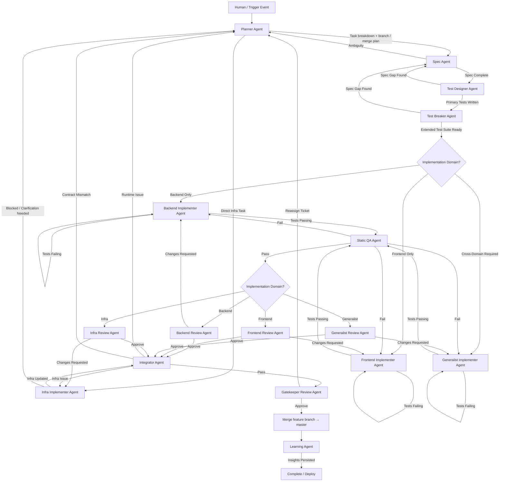

Agents are not allowed to edit files within this folder.

# Multi-Agent Test-Driven Development Workflow

## Core Rules (Applies to All Agents)
- **Workflow compliance:** All execution must comply with the Workflow Enforcement Module (`agent_context/agents/common_assets/workflow_enforcement_v1.md`) in addition to each agent's role definition. Read that module before acting on any ticket.
- **Ticket Template:** All tickets must be written using the Ticket Template (`agent_context/agents/common_assets/ticket_template_v1.md`). Read that template before writing any ticket.
- **Project context:** When working a ticket under `agent_context/projects/<project>/`, read that project's README (and any "Existing codebase" or "Integrate with" section) so implementation extends existing code and does not duplicate or ignore it. Grep the codebase for related names before implementing.
- Any unclear or ambiguous instructions **must be questioned** before proceeding.
- No agent may make silent assumptions about requirements.
- Agents may only modify files within their assigned ownership.
- Failing tests are the primary feedback mechanism for implementation.
- **Git / VCS:** Commit between handoffs (before updating the ticket for the next agent). On ticket completion (Stage → COMPLETE, move to 02_complete/), commit on the **feature branch** and **push that branch** to the remote (`git push -u origin <feature-branch>`). **Do not** push `master` (or the default integration branch) from autonomous runs unless the human explicitly requests it. Work uses a **feature branch** named in the Planner output; **merge into `master`** is via **PR / human / CI** per Workflow Enforcement Module.

### Git checkpoints
- **Feature branch (per ticket):** The **Planner** names a dedicated branch in the plan using the format `<project>-<ticket>/<title>` (e.g. `stratos-STRATOS-45/aws-credentials`, `terminus-issue-6.2/frontend-test-suite`). The first agent that performs implementation ensures that branch exists, is checked out from up-to-date **`master`** (or the project’s default integration branch if documented elsewhere), and that all subsequent handoff commits land on that branch until merge.
- **Between handoffs:** Before updating the ticket with the new stage and NEXT ACTION for the next agent, commit all changes (code, tests, ticket file) with a message that references the ticket.
- **Merge into `master` (default policy):** After **Gatekeeper** approval, the **merge milestone** means: feature branch is green, **PR opened or updated** (or equivalent), and a **human or CI merges** into **`master`**. The orchestrator does **not** locally merge into `master` and push `master` unless the human explicitly asks for that. If the ticket defers merge, document that in the ticket.
- **Push to remote:** After meaningful commits and especially at **COMPLETE**, run `git push -u origin <feature-branch>`. Never treat “push to remote” as “push `master`” by default.
- **After ticket completion:** When setting Stage to COMPLETE and moving the ticket to 02_complete/, final commits stay on the **feature branch**; push **that branch**. Post-merge `master` updates happen on the human’s machine or via the hosting provider after the PR merges—not by pushing `master` from the agent unless explicitly instructed.

### Orchestrator, autopilot, and ap-continue (single source of truth)
**Git push, merge, and completion steps** for any orchestrator (including Cursor autopilot or `ap-continue`) are defined **only** here (**Git checkpoints** above) and in **`agent_context/agents/common_assets/workflow_enforcement_v1.md` § GIT / VCS**. IDE or Claude **skills must not copy or extend** those rules; they should **reference** these two locations so policy stays maintainable in one place.

### Markdown audit checkpoints (not Git)
**Git checkpoints** (above) are VCS policy. **Markdown audit checkpoints** record autonomous assumptions and “would have asked” items: full entries live only under `agent_context/projects/<PROJECT>/project_board/checkpoints/<ticket-id>/<run-id>.md`; `project_board/CHECKPOINTS.md` is **index-only** (pointers and short metadata). Consumers (**Learning Agent**, reviews, humans): read scoped logs first, then the index, then any `project_board/checkpoints/frozen/` archive if migrating from a monolith. See `AGENTS.md` and `.cursor/skills/autopilot/SKILL.md` → **Hard rules — checkpoint audit trail**.

## Mermaid Diagram

### Multi-Agent Test-Driven Development Workflow


### Ticket State Diagram
```mermaid
flowchart TD

    %% Ticket State Container
    T[(Ticket File<br>agent_context/projects/<project>/XX_<ticket>.md)]

    %% Backlog to Active
    B[00_backlog/] -->|Move to Active| A[01_active/]

    %% Planner
    A --> P[Planner Agent]
    P -->|Update Stage: PLANNING → SPECIFICATION| T

    %% Spec Phase
    T --> S[Spec Agent]
    S -->|Update Stage: SPECIFICATION → TEST_DESIGN| T
    S -->|Ambiguity| P

    %% Test Design
    T --> TD[Test Designer Agent]
    TD -->|Stage: TEST_DESIGN → TEST_BREAK| T
    TD -->|Spec Gap| S

    %% Test Break
    T --> TB[Test Breaker Agent]
    TB -->|Stage: TEST_BREAK → IMPLEMENTATION_*| T
    TB -->|Spec Gap| S

    %% Implementation Routing
    T -->|Backend| BI[Backend Implementer]
    T -->|Frontend| FI[Frontend Implementer]
    T -->|Cross Domain| GI[Generalist Implementer]

    BI -->|Stage: IMPLEMENTATION_BACKEND → STATIC_QA| T
    FI -->|Stage: IMPLEMENTATION_FRONTEND → STATIC_QA| T
    GI -->|Stage: IMPLEMENTATION_GENERALIST → STATIC_QA| T

    %% Static QA
    T --> QA[Static QA Agent]
    QA -->|Fail → Back to Implementer| BI
    QA -->|Pass → Stage: STATIC_QA → CODE_REVIEW_*| T

    %% Code Review (per engineer type)
    T --> RV[Code Review Agent (Backend/Frontend/Infra/Generalist)]
    RV -->|Changes Requested → Back to Implementer| BI
    RV -->|Stage: CODE_REVIEW_* → INTEGRATION| T

    %% Integration
    T --> I[Integrator Agent]
    I -->|Runtime Issue → PLANNING| P
    I -->|Pass → GATEKEEPER_REVIEW| T

    %% Final Gatekeeper (after approve: merge feature branch → master per Planner, then LEARNING)
    T --> G[Gatekeeper Review Agent]
    G -->|Approve → Stage: LEARNING| T
    G -->|Reassign → Appropriate Agent| P

    %% Learning Phase
    T --> LA[Learning Agent]
    LA -->|Persist insights to memory graph| T
    LA -->|Stage: LEARNING → COMPLETE| T

    %% Completion
    T -->|Stage: COMPLETE| C[02_complete/]
```

### Branch and merge (summary)
- The **Planner** records a **feature branch** name and a **merge into `master`** milestone (see **Git checkpoints** above). In practice that milestone is satisfied by **PR + human/CI merge**, not by the agent pushing `master`. The main workflow diagram shows **Merge feature branch → master** after **Gatekeeper** approval and before the **Learning** agent. The ticket diagram keeps the same stage enum; merge is an explicit VCS step tied to Gatekeeper approval, not a separate `Stage` value.

---

# Agent Roles

## 1. Planner Agent
**Purpose:** Orchestration authority; transforms input into a structured execution plan.

**Owns:**
- Task breakdown
- Agent assignment
- Dependency ordering
- Milestone sequencing
- **Git strategy per ticket:** a single **feature branch** name and an explicit **merge-back** milestone into **`master`** (or the repo’s documented default integration branch)

**Restrictions:**
- Cannot write implementation code
- Cannot write tests
- Cannot modify infrastructure

**Outputs:**
- Numbered tasks (include **early task:** ensure feature branch exists from up-to-date **`master`** before implementation commits)
- Responsible agent assignment
- Inputs, outputs, and dependencies
- Risk and clarification flags
- **Feature branch name** (convention: `<project>-<ticket>/<title>`; e.g. `stratos-STRATOS-45/aws-credentials`; must be unique and readable)
- **Final milestone:** after Gatekeeper approval, **PR (or equivalent) + merge by human or CI** into **`master`** by default; call out who opens the PR and who merges. Only use local merge + push `master` if project policy or the human explicitly requires it.

---

## 2. Spec Agent
**Purpose:** Defines behavioral contracts and requirements before tests are written.

**Owns:**
- Functional specifications
- Non-functional requirements
- Constraints
- Assumptions
- Risk analysis
- Acceptance criteria

**Restrictions:**
- Cannot write implementation code
- Cannot write test files

**Outputs:**
- Spec summary
- Clarifying questions if any ambiguity exists

---

## 3. Test Designer Agent
**Purpose:** Converts specification into executable behavioral tests.

**Owns:**
- `/tests/**`
- Test Intent Map
- Primary behavioral tests

**Responsibilities:**
- Define expected behavior
- Define edge cases
- Define error states
- Ensure deterministic test design

**Restrictions:**
- Cannot modify implementation (`/src/**`)
- Cannot modify infrastructure

---

## 4. Test Breaker Agent
**Purpose:** Adversarial testing to expose gaps and edge cases.

**Owns:**
- `/tests/**`
- Mutation and stress tests

**Responsibilities:**
- Detect incomplete coverage
- Challenge assumptions
- Add tests for edge cases and rare scenarios

**Restrictions:**
- Cannot modify implementation
- Cannot relax behavior or test intent

---

## 5. Backend Implementer Agent
**Purpose:** Implements server-side logic.

**Owns:**
- `/src/backend/**`

**Responsibilities:**
- Business logic
- API endpoints
- Data models
- Database interactions

**Restrictions:**
- Cannot modify frontend
- Cannot modify infra
- Cannot modify tests

---

## 6. Frontend Implementer Agent
**Purpose:** Implements client-side logic.

**Owns:**
- `/src/frontend/**`

**Responsibilities:**
- UI components
- Client state management
- API consumption
- Client-side validation

**Restrictions:**
- Cannot modify backend
- Cannot modify infra
- Cannot modify tests

---

## 7. Infra Implementer Agent
**Purpose:** Implements infrastructure and deployment configuration.

**Owns:**
- `/infra/**`
- `/deploy/**`
- Dockerfiles, CI/CD configs, IaC files

**Responsibilities:**
- Deployment configuration
- Environment setup
- Containerization
- CI/CD wiring
- Infrastructure as Code

**Restrictions:**
- Cannot modify business logic
- Cannot modify tests

---

## 8. Generalist Implementer Agent
**Purpose:** Handles tasks requiring coordinated changes across multiple domains.

**May Modify:**
- `/src/backend/**`
- `/src/frontend/**`
- `/infra/**` (only when explicitly assigned)

**Responsibilities:**
- Cross-cutting refactors
- Shared abstractions
- Interface contract alignment
- Coordinated backend + frontend changes
- System-wide performance optimizations

**Restrictions:**
- Cannot modify tests
- Cannot redefine behavior
- Must respect test intent
- Planner must explicitly justify use

---

## 9. Static QA Agent
**Purpose:** Enforces mechanical correctness.

**Responsibilities:**
- Linting
- Type checking
- Formatting rules
- Static security policies
- Forbidden dependency enforcement

**Outputs:**
- Structured issue reports
- Pass/fail status

**Restrictions:**
- Cannot rewrite code without explicit assignment

---

## 10. Integrator Agent
**Purpose:** Validates runtime and operational correctness.

**Responsibilities:**
- Runtime safety checks
- Observability requirements
- Logging and health checks
- Operational testing
- Frontend-backend contract validation
- Deployment validation
- **Git (when the Planner assigns it):** confirm the **feature branch** is green and ready; **hand off** merge via **PR / human / CI** (or document exact merge steps). Do not assume the agent pushes `master`; ensure the feature branch is pushed for review, after Gatekeeper approval and before final **COMPLETE** if merge is not deferred on the ticket

**Can:**
- Require new tests
- Require infra updates

**Restrictions:**
- Cannot modify implementation directly

---

## 11–15. Review & Gatekeeper Agents

These review-oriented agents and the final gatekeeper are defined **only under** `agent_context/agents/**` and are orchestrated via the workflow there.
Use `agent_context/agents/readme.md` as the source of truth for their responsibilities and prompts.

---

## 16. Learning Agent
**Purpose:** Extracts generalizable engineering insights from completed work and persists them to the memory graph.

**Runs:** After Gatekeeper approval, before ticket moves to COMPLETE.

**Owns:**
- `/learning-output.md` (per ticket)
- Memory graph nodes and relations (via contextplus MCP)

**Inputs (checkpoints):** Prefer `agent_context/projects/<PROJECT>/project_board/checkpoints/<ticket-id>/<run-id>.md` for assumption audit detail; use `project_board/CHECKPOINTS.md` only as a pointer index; use `project_board/checkpoints/frozen/` only when reading legacy history.

**Responsibilities:**
- Extract reusable insights from completed task outputs, test results, bugs, and agent artifacts
- Identify anti-patterns, prompt patches, and workflow improvements
- Persist learnings via `upsert_memory_node` and `create_relation`
- Run `prune_stale_links` periodically to decay outdated memory edges

**Restrictions:**
- Cannot write code
- Cannot modify tests, implementation, or infrastructure
- Cannot modify other agents' artifacts
- May NOT fabricate insights — if input is insufficient, asks clarifying questions

**Outputs:**
- `/learning-output.md` with structured sections: Learnings, Anti-Patterns, Prompt Patches, Workflow Improvements
- Memory graph nodes persisted for future agent sessions